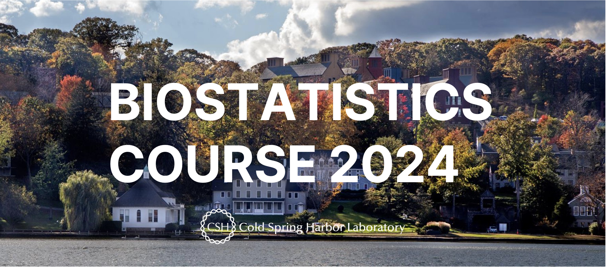

  

 

 

<strong>🚨 Biostatistics Course 2024 Archived </strong>  

The materials for the Biostatistics Course 2024 have been archived and are now available on the Cold Spring Harbor Laboratory Biostatistics page. To access these materials and those from previous years, please visit [this link](https://taehoonh.me/CSHLbiostat).
 

 

This course is designed to provide an introduction to biostatistics, the application of statistical methods to analyze and interpret data in the field of biology and health sciences. The course will cover the basic principles of probability theory, statistical inference, and hypothesis testing. Participants will learn how to use statistical software, including Prism Graphpad, to analyze datasets and draw conclusions from their findings.

For registration information, please contact [Jessica Peluso](mailto:peluso@cshl.edu).

<!-- please refer to the [Biostatistics Course Flyer](images/Biostatistics Course Flyer.pdf) for more details. -->

 

**COURSE OBJECTIVES:**

Understand the basic principles of probability theory, statistical inference, and hypothesis testing.
Understand how to use Prism Graphpad to analyze datasets and draw conclusions from their findings.
Learn how to use various statistical tests to analyze and interpret data in the field of biology and medical sciences.

Gain an understanding of correlation and regression analysis.
Prepare participants for more advanced topics in biostatistics.

 

**INSTRUCTOR:**

* Taehoon Ha, MS ([ha@cshl.edu](mailto:ha@cshl.edu))

 

**PREREQUISITES:**

There are no statistical prerequisites for attending this course. Participants must
have access to a computer and install Prism Graphpad software before attending the course. Please contact [Jessica Peluso](mailto:peluso@cshl.edu) prior to purchasing a license to see if you are eligible for free access to Graphpad!

 

**DATE/TIME/LOCATION:**

| Date               | Time            | Location                       |
|--------------------|-----------------|--------------------------------|
| July 8, 2024 (Monday)    | 10AM - 12PM     | Hawkins                        |
| July 9, 2024 (Tuesday)   | 10AM - 12PM     | Hawkins                        |
| July 10, 2024 (Wednesday)| 10AM - 12PM     | Hawkins                        |
| July 11, 2024 (Thursday) | 10AM - 12PM     | Hawkins                        |
| July 12, 2024 (Friday)   | 2PM - 4PM       | Wendt Conference Room #5513    |

 

**CHECK-IN (ATTENDANCE):**

To check in for the Biostatistics Course 2024, please click on the following link: [https://bit.ly/cshlbiostat2024checkin](https://bit.ly/cshlbiostat2024checkin)

Enter your name, lab, and date, then click submit. For any assistance, please contact the course coordinator.

 

QR Code:
 

 