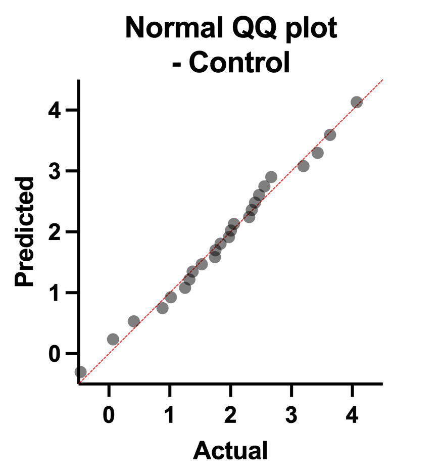

 

### Question 1

A group of researchers is investigating the effects of a potential cancer treatment on the expression levels of a specific gene, 'Gene Y.' They collected expression data from two groups: a control group and a treatment group. The control group consists of 25 mice with cancer that did not receive the treatment, while the treatment group consists of 30 mice with cancer that underwent the treatment. The researchers are interested in checking the normality of the expression levels for each group.

You can download the data [HERE](files/lec3/geneY.pzfx).

Could you please create separate Q-Q plots for the control group and the treatment group based on the expression levels of Gene Y? Once the plots are generated, visually assess the normality of each group's distribution and provide an interpretation of the results.

 

  
<strong>Answer to Question 1:</strong>

  
 

  
  

Based on the visual analysis of the Q-Q plots, it can be concluded that both the control and treatment group data exhibit a normal distribution, indicating that the assumption of normality is reasonable for further statistical analyses and interpretations related to the gene expression levels in this study.

  

<a href="schedule.html">< Go Back</a>
