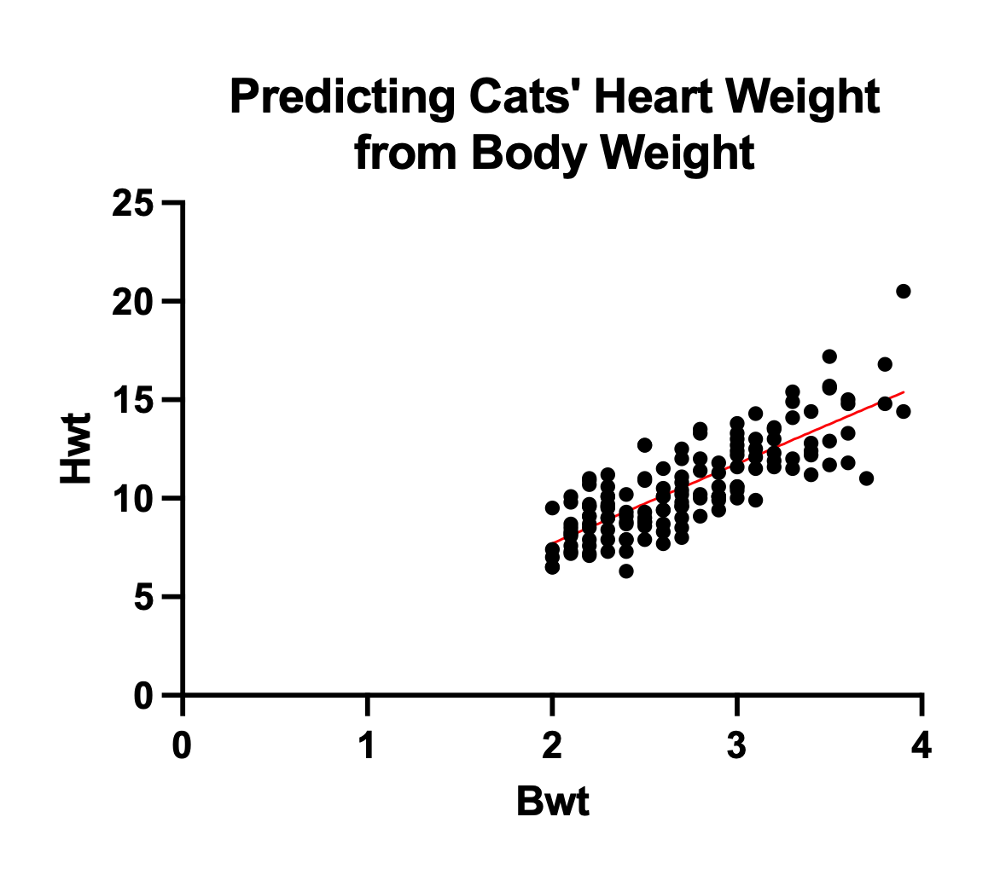

 

### Question 1: Simple Linear Regression

You can download the dataset [HERE](files/lec5/cats.pzfx). 

You are provided with a cats' heart weight and body weight dataset, and your task is to perform a simple linear regression using Prism Graphpad. The dataset contains tho variables: `Hwt` (dependent variable) and `Bwt` (independent variables). Follow the steps below to conduct the analysis and interpret the results:

Perform a simple linear regression using Prism Graphpad, with `Hwt` as the dependent variable and `Bwt` as an independent variable. Display the summary of the linear regression model to obtain the estimated coefficient for `Bwt`. Interpret the coefficient and $R^2$ obtained from the regression model.

 

  
<strong>Answer to Question 1:</strong>

  
 

 

**- Slope: 4.034**

Indicates that, on average, cats' heart weight increases by 4.034 units for every one-unit increase in their body weight. This positive slope suggests a positive linear relationship between cats' body weight and heart weight.

**- Y-intercept: -0.3567**

Implies that when cats have a body weight of zero (which is not practically meaningful for this context), their estimated heart weight is -0.3567 units. The Y-intercept may not be directly interpretable in this case due to the unrealistic value of zero body weight.

**- $R^2$: 0.6466**
Suggests that approximately 64.66% of the variation in cats' heart weight can be explained by variations in their body weight. This R-squared value indicates a moderate level of correlation between the two variables.

The very low p-value (<0.0001) implies that cats' body weight has a statistically significant impact on their heart weight. The significant slope confirms that there is a meaningful relationship between the two variables in the dataset.

  

### Question 2: Multiple Linear Regression

After conducting a simple linear regression, we now seek to enhance our analysis by introducing an additional independent variable, `Sex`, and fitting a new multiple linear regression model.

Using Prism Graphpad, perform a multiple linear regression model with Hwt (cats' heart weight) as the outcome variable and Bwt (body weight) and Sex as independent variables. Obtain the summary of the linear regression model to extract the estimated coefficients for Bwt and Sex. Please interpret each coefficient, keeping in mind that Bwt is a continuous variable, while Sex is categorical. 

You can download the dataset [HERE](files/lec5/cats_multiple.pzfx).

 

  
<strong>Answer to Question 2:</strong>

  
 

- Intercept ($\beta_0$): 1.060, with a standard error of 0.1020. It is significantly different from zero (t = 10.40, p < 0.0001), implying that when all other predictors are zero, the estimated `Bwt` is 1.060. The Y-intercept may not be directly interpretable in this case due to the unrealistic value of zero body weight for female cats.

- Sex[M] ($\beta_1$): 0.2410, with a standard error of 0.05284. It is significantly different from zero (t = 4.561, p < 0.0001), indicating that, on average, cats with a `Sex` value of `M` (male cats) have a 0.2410 unit increase in `Bwt` compared to cats with `Sex` value of `F` (female cats).

- Hwt ($\beta_2$): 0.1412, with a standard error of 0.01021. It is significantly different from zero (t = 13.83, p < 0.0001), suggesting that for each one-unit increase in `Hwt`, there is a 0.1412 unit increase in `Bwt`.

In addition to the interpretation, we can also check the following information according to the Prism Graphpad analysis result:

- The multiple linear regression model is statistically significant (p < 0.0001), as indicated by the F-test (F(2, 141) = 158.4), suggesting that the independent variables collectively have a significant impact on the dependent variable, `Bwt`.

- The model's goodness of fit is represented by R-squared, which is 0.6920, indicating that approximately 69.20% of the variation in `Bwt` is explained by the independent variables (`Sex` and `Hwt`) in the model.

- The residuals' normality tests (D'Agostino-Pearson omnibus, Anderson-Darling, Shapiro-Wilk, and Kolmogorov-Smirnov) indicate that the assumption of normality for the residuals is satisfied, suggesting the model's residuals are normally distributed.

- In the initial multiple linear regression model (`Hwt ~ Bwt + Sex`), we assess the separate impacts of `Bwt` (body weight) and `Sex` (categorical variable) on predicting cats' heart weight (Hwt) without considering their interaction. The expanded model (`Hwt ~ Bwt + Sex + Bwt:Sex`) introduces the interaction term `Bwt:Sex` to examine whether the relationship between `Bwt` and `Hwt` varies between male and female cats, as there could be an association between body weight and gender. An ANOVA test will determine the significance of the interaction, helping us assess whether including it improves the model's ability to predict `Hwt` accurately for cats.

  

<a href="schedule.html">< Go Back</a>
